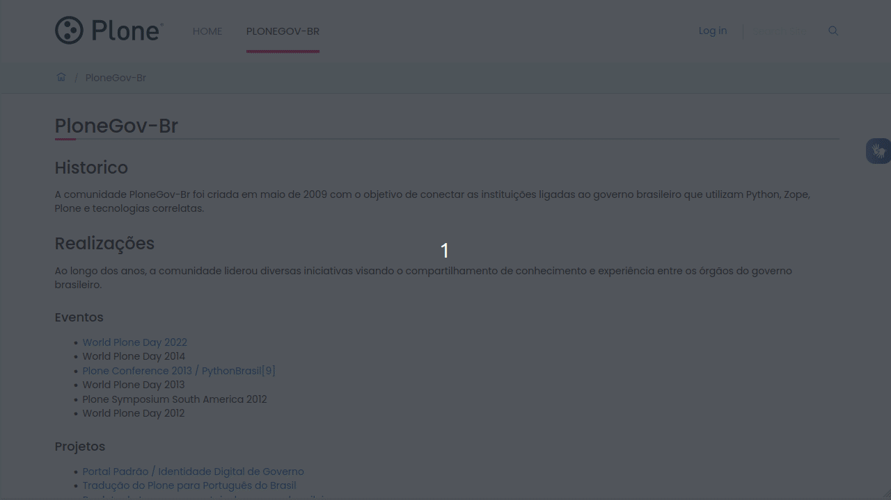
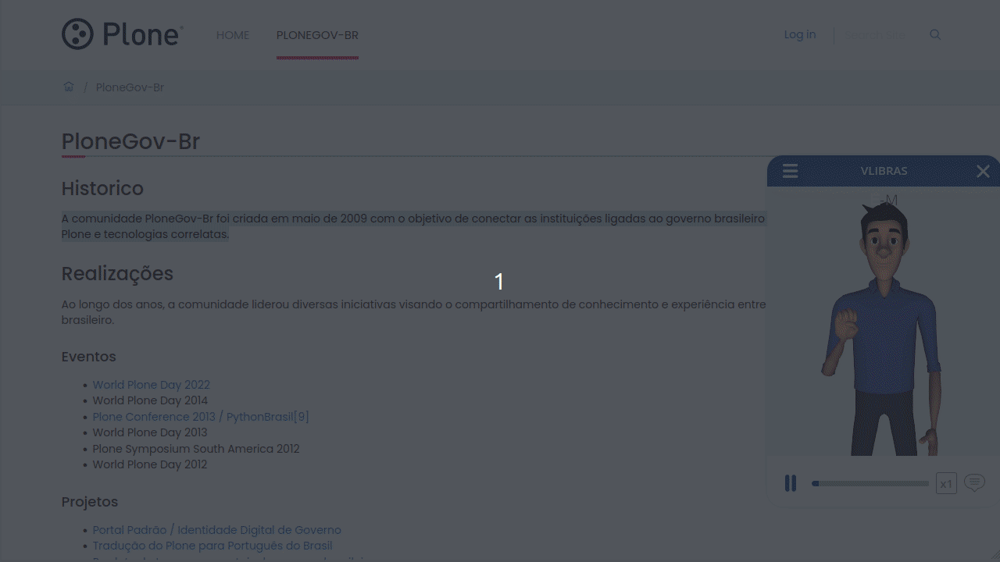

# VLibras support for Plone (@plonegovbr/volto-vlibras)

An addon integrating the VLibras service into a Plone site running Volto.

[](https://www.npmjs.com/package/@plonegovbr/volto-vlibras)
[](https://kitconcept.github.io/volto-vlibras/)
[](https://github.com/plonegovbr/volto-vlibras/actions/workflows/code.yml)
[](https://github.com/plonegovbr/volto-vlibras/actions/workflows/unit.yml)

## Screenshots

### Opening VLibras Widget



### Using the Widget




## Install

Create a new Volto project (you can skip this step if you already have one):

```
npm install -g yo @plone/generator-volto
yo @plone/volto my-volto-project --addon @plonegovbr/volto-vlibras
cd my-volto-project
```

Add `@plonegovbr/volto-vlibras` to your package.json:

```JSON
"addons": [
    "@plonegovbr/volto-vlibras"
],

"dependencies": {
    "@plonegovbr/volto-vlibras": "*"
}
```

Download and install the new add-on by running:

```
yarn install
```

Start volto with:

```
yarn start
```

### Configuration <a name="config"></a>

To inject the component in the project add the appextras configuration in the `config.js` file.

A suggested way is to use `appExtras` from settings object ([docs](https://6.docs.plone.org/volto/development/appextras.html)):

```jsx
import Libras from '@plonegovbr/volto-vlibras/components/Libras';

const applyConfig = (config) => {
  config.settings.appExtras = [
    ...config.settings.appExtras,
    {
      match: '',
      component: Libras,
    },
  ];
  return config;

};
```

### Test it

Go to http://localhost:3000/, login and check the awesome new features.

## Development

The development of this add-on is done in isolation using a new approach using pnpm workspaces and latest `mrs-developer` and other Volto core improvements.
For this reason, it only works with pnpm and Volto 18 (currently in alpha)

### Requisites

- Volto 18
- pnpm as package manager

### Make convenience commands

Run `make help` to list the available commands.

```text
help                                 Show this help
install                              Installs the dev environment using mrs-developer
i18n                                 Sync i18n
format                               Format codebase
lint                                 Lint Codebase
test                                 Run unit tests
test-ci                              Run unit tests in CI
storybook-start                      Start Storybook server on port 6006
storybook-build                      Build Storybook
start-backend-docker                 Starts a Docker-based backend for developing
start-test-acceptance-frontend-dev   Start acceptance frontend in dev mode
start-test-acceptance-frontend       Start acceptance frontend in prod mode
start-test-acceptance-server         Start acceptance server
test-acceptance                      Start Cypress in interactive mode
test-acceptance-headless             Run cypress tests in headless mode for CI
```

### Development Environment Setup

Install package requirements

```shell
make install
```

### Start developing

Run (in separate terminal sessions)

Start backend server

```shell
make start-backend-docker
```

Start frontend

```shell
pnpm start
```

### Linting

Run ESlint, Prettier and Stylelint

```shell
make lint
```

### Formatting

Run ESlint, Prettier and Stylelint in fix mode

```shell
make format
```

### i18n

Extract the i18n messages to locales

```shell
make i18n
```

### Unit tests

Run unit tests

```shell
make test
```

### Run Cypress tests

Run (in separate terminal sessions)

Start the frontend in dev mode

```shell
make start-test-acceptance-frontend-dev
```

Start the backend acceptance server

```shell
make start-test-acceptance-server
```

Start the Cypress interactive test runner

```shell
make test-acceptance
```
## Credits

The development of this add on was sponsored by the Brazilian Plone Community

[](https://plone.org.br/)

## License

The project is licensed under the MIT license.
